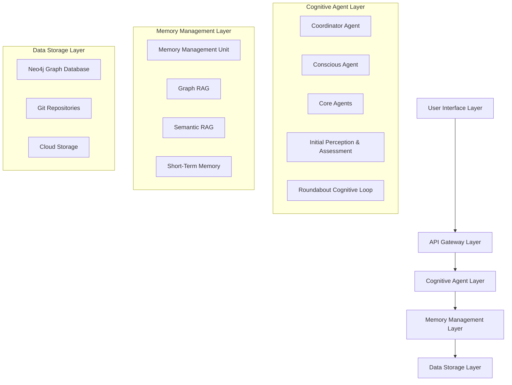
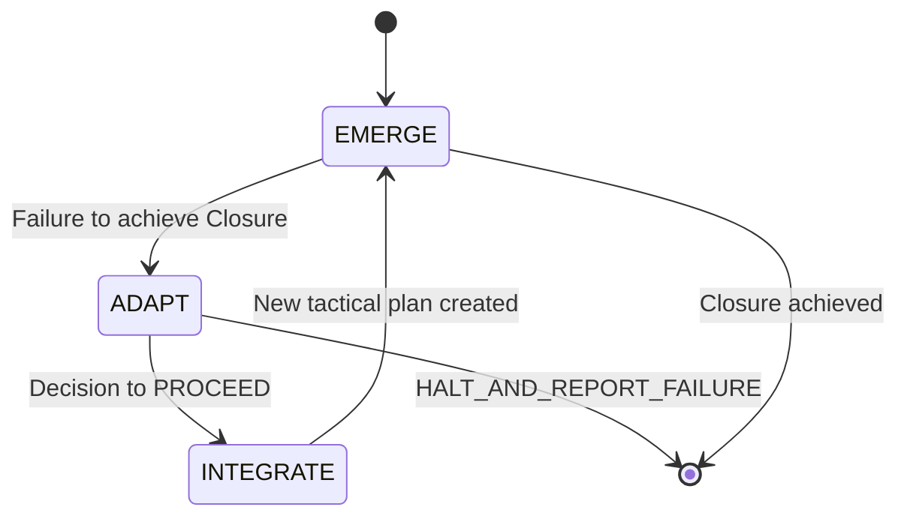

# Design Document

## Overview

The Community Outreach System is a sophisticated cognitive agent platform designed to serve as an empathetic digital companion for senior users. The system combines advanced AI capabilities with an intuitive user interface, enabling seamless thought capture, content creation, and collaboration while maintaining complete privacy and consent control.

The architecture is built around five core principles: Unified Fractal Intelligence, Psychologically-Grounded Cognition, Attentive Autonomy, Absolute User-Centricity, and Memory as Lived Experience. These principles ensure the system operates as a cohesive, empathetic partner rather than just a collection of features.

## Architecture

### High-Level Architecture

The system follows a layered architecture with clear separation of concerns:



### Core Architectural Principles Implementation

1. **Unified Fractal Intelligence**: All intelligence operations use the single `CognitiveAgent` class with role-based configuration
2. **Psychologically-Grounded Cognition**: The "Roundabout" loop (EMERGE → ADAPT → INTEGRATE) governs all agent decision-making
3. **Attentive Autonomy**: System immediately switches from Autonomous to Attentive mode when user input is detected
4. **Absolute User-Centricity**: "Complexity Shield" hides technical details from senior users
5. **Memory as Lived Experience**: Dual RAG system (Graph + Semantic) with emotional context storage

## Components and Interfaces

### 1. User Interface Components

#### Adaptive Layout System
- **Arbetsläget** (Desktop/Tablet): Side-by-side "Samtalet" and "Sidorna" views
- **Flik-läget** (Mobile): Single view with bottom tab navigation
- **Progressive Zooming**: Three-level navigation (Linear → Filtered → Graph)

#### WYSIWYG-JSON Editor
- Block-based editing with JSON output conforming to UIStateTree structure
- Soft block-level locking for real-time collaboration
- Creative Flow mode (default) vs Suggestion Mode (on-demand)

### 2. Cognitive Agent System

#### CognitiveAgent Class
```typescript
interface CognitiveAgent {
  id: string;
  role: 'Coordinator' | 'Conscious' | 'Core';
  configurationProfile: ConfigurationProfile;
  contextThread: ContextThread;
  currentPhase: 'EMERGE' | 'ADAPT' | 'INTEGRATE';
  
  processInput(input: UserInput): Promise<AgentResponse>;
  clone(childConfig: ConfigurationProfile): CognitiveAgent;
  executeRoundaboutLoop(): Promise<void>;
}
```

#### Initial Perception & Assessment (IPB)
- **Initial Triage**: Single low-latency LLM call for triviality check
- **Psycho-linguistic Analysis Engine (PLAE)**: Parallel analysis of FIGHT/FLIGHT/FIXES dimensions
- **User State Vector**: Multi-dimensional emotional state representation

#### Roundabout Cognitive Loop


### 3. Memory Management System

#### Memory Management Unit (MMU)
- Centralized API for all long-term memory operations
- ACID-compliant transactions for Graph RAG
- Optimistic Concurrency Control for conflict resolution
- Memory scope enforcement based on Context Thread

#### Dual RAG Architecture
- **Graph RAG**: Structured data with Neo4j backend
- **Semantic RAG**: Associative data for creative thinking
- **Emotional Context**: User_State vectors stored with significant events

### 4. Resource Management

#### Resource Governor
- Centralized approval for resource-intensive operations
- User-specific quotas (LLM usage, storage, compute units)
- System-wide safety limits (max recursion depth, active agents)
- Circuit breaker functionality for error rate/cost spikes

### 5. Data Models

#### User & Relationship Models
```typescript
interface User {
  id: string;
  user_role: 'senior' | 'architect';
  profile: UserProfile;
  contacts: Contact[];
  consents: Consent[];
}

interface Contact {
  id: string;
  contactDetails: EncryptedContactDetails;
  groups: ContactGroup[];
}

interface Consent {
  id: string;
  scope: string;
  status: 'active' | 'revoked';
  appliesTo: Contact | ContactGroup;
}
```

#### Project Data Models
```typescript
interface Project {
  id: string;
  metadata: ProjectMetadata;
  gitRepositoryUrl: string;
  assets: Asset[];
}

interface Asset {
  id: string;
  storageURL: string;
  metadata: AssetMetadata;
}
```

## Data Models

### Graph Database Schema (Neo4j)

#### Core Entities
- `(User)`: User profiles and authentication
- `(Contact)`: User contacts with encrypted details
- `(ContactGroup)`: Contact groupings
- `(Consent)`: Permission and consent management
- `(Project)`: Project metadata
- `(Asset)`: Binary asset references
- `(Event)`: Significant user interactions
- `(Theme)`: Thematic categorization
- `(Trigger)`: Legacy content delivery triggers

#### Relationships
- `[:OWNS_CONTACT]`: User to Contact
- `[:IS_MEMBER_OF]`: Contact to ContactGroup
- `[:HAS_GIVEN]`: User to Consent
- `[:APPLIES_TO]`: Consent to Contact/ContactGroup
- `[:PARTICIPATED_IN]`: User to Event
- `[:RELATES_TO]`: Event to Theme
- `[:TRIGGERS_ON]`: LegacyContent to Trigger

### File System Structure
```
projects/
├── {project-id}/
│   ├── .git/
│   ├── UIStateTree.json
│   ├── src/
│   └── tests/
└── assets/
    └── {asset-id}.{extension}
```

## Error Handling

### Cognitive Agent Error Handling
- **ADAPT Phase Activation**: Failures trigger mandatory ADAPT phase
- **Strategic Decisions**: HALT_AND_REPORT_FAILURE vs PROCEED
- **Parent-Child Error Propagation**: Child failures reported to parent agents

### Memory System Error Handling
- **Conflict Resolution**: Optimistic Concurrency Control with ConflictError responses
- **Transaction Rollback**: ACID compliance ensures data integrity
- **Scope Violations**: Memory scope enforcement prevents unauthorized access

### Resource Management Error Handling
- **Quota Enforcement**: Hard limits with graceful degradation
- **Circuit Breaker**: Automatic pause for high error rates
- **Timeout Handling**: Configurable timeouts for all operations

### User Interface Error Handling
- **Graceful Degradation**: Fallback to simpler interfaces on errors
- **Semantic Diff Conflicts**: Visual conflict resolution in WYSIWYG editor
- **Collaboration Conflicts**: Soft locking prevents edit conflicts

## Testing Strategy

### Hierarchical Test-Driven Development (TDD)

#### Level 1: End-to-End Tests
- **Coordinator Agent**: Creates failing E2E test defining "Definition of Done"
- **Mission Completion**: E2E test must pass for feature completion
- **User Journey Coverage**: Complete user workflows from start to finish

#### Level 2: Integration Tests
- **Core Agent**: Creates failing integration tests for delegated tasks
- **Component Integration**: Tests between major system components
- **API Contract Testing**: Ensures interface compatibility

#### Level 3: Unit Tests
- **Individual Functions**: Comprehensive unit test coverage
- **Cognitive Loop Testing**: Each phase of Roundabout loop tested independently
- **Memory Operations**: CRUD operations and constraint validation

### Test Categories

#### Functional Testing
- User story acceptance criteria validation
- Cognitive agent behavior verification
- Memory system consistency checks
- Resource governance compliance

#### Non-Functional Testing
- Performance testing for LLM operations
- Security testing for data encryption
- Scalability testing for concurrent users
- Usability testing with senior users

#### Integration Testing
- Graph RAG and Semantic RAG integration
- Real-time collaboration functionality
- External service integrations (Gmail, Google Photos)
- Cross-platform UI responsiveness

### Test Environment Strategy
- **Isolated Sandbox**: All development and testing in isolated environment
- **Mock Services**: LLM and external service mocking for consistent testing
- **Data Fixtures**: Standardized test data for reproducible results
- **Continuous Integration**: Automated test execution on code changes

### Quality Assurance Policies
- **Mandatory TDD**: No feature complete without passing E2E test
- **Code Review**: Human architect approval for all autonomous development
- **Security Review**: Mandatory security assessment for data handling features
- **Accessibility Compliance**: WCAG 2.1 AA compliance for all UI components

This design provides a comprehensive foundation for implementing the Community Outreach System while maintaining the sophisticated cognitive architecture and user-centric approach defined in the requirements.